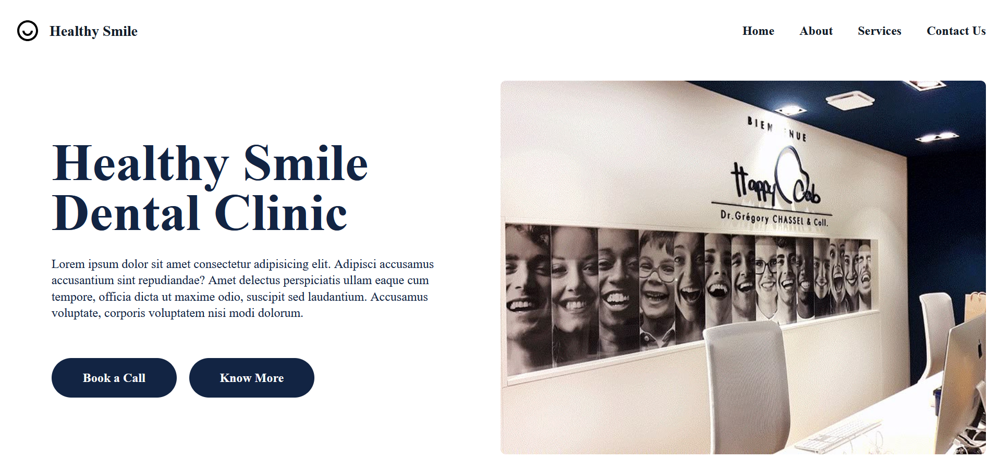

# Dental Clinic Website (In Development)

A modern, professional single-page website concept designed for a healthcare clinic. This project showcases clean structural layouts, semantic styling, and structured element alignments.

##  📸 Preview

## ✨ Features
* **Structured Grid/Flex Layouts:** Engineered completely from scratch using CSS Flexbox for pixel-perfect structural layouts.
* **Semantic Document Hierarchy:** Built with modern HTML5 landmarks to guarantee accessible document structures.
* **Clean Component Architectures:** Organized with clear design alignments for headers, navigation blocks, and appointment segments.

## 🛠️ Technologies Used
* HTML5
* CSS3
* Core UI Design Systems